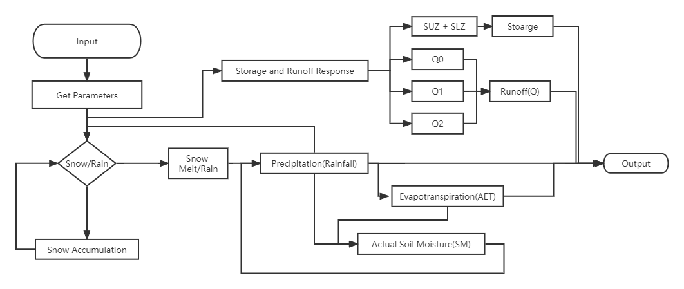

# HBV model Builder

- [HBV model Builder](#hbv-model-builder)
  - [Introduction](#introduction)
    - [Overview](#overview)
    - [Implementation](#implementation)
      - [Snowmelt and Accumulation](#snowmelt-and-accumulation)
      - [Effective Precipitation](#effective-precipitation)
      - [Evapotranspiration](#evapotranspiration)
      - [Storage and Runoff](#storage-and-runoff)
      - [NSE](#nse)
  - [Getting Start](#getting-start)
    - [Program](#program)
      - [Overview Information](#overview-information)
      - [Documentation](#documentation)
        - [Run with Example Data](#run-with-example-data)
      - [Start Your Own HBV model](#start-your-own-hbv-model)
      - [Modify the program](#modify-the-program)
        - [Print Overview of Program](#print-overview-of-program)
        - [Print Help Information](#print-help-information)
        - [Run HBV model](#run-hbv-model)
    - [hbv\_model.hpp](#hbv_modelhpp)
      - [Included in your program](#included-in-your-program)
      - [Constructor](#constructor)
      - [Getting Result of HBV model](#getting-result-of-hbv-model)
      - [Get Suggestion Based on NSE](#get-suggestion-based-on-nse)
      - [Calculate Average value of Observe Q (Private Function)](#calculate-average-value-of-observe-q-private-function)
      - [Set Parameters (Private Function)](#set-parameters-private-function)
      - [Check Range of Parameters(Private Function)](#check-range-of-parametersprivate-function)
      - [Check value inbound (Private Function)](#check-value-inbound-private-function)
      - [Calculate HBV model (Private Function)](#calculate-hbv-model-private-function)
  - [Input File](#input-file)
    - [Data File](#data-file)
    - [Parameter File](#parameter-file)
  - [Example Output](#example-output)

## Introduction

### Overview

HBV model is a traditional hydrologic model to predict area runoff/discharge based on most basic elements
which developed in 1972. It still used in some areas currently as a tool that convert meteorological observation
to discharge[^1]. And this is a simplified implementation by C++ based on content of McMaster University CIVENG 6M03 class's lab. This program can build HBV model easily with given dataset and parameters, then generate the data file with NSE value.

### Implementation

There are 5 part in building a hbv model. The flow chart of core component of implementing HBV model as shown in figure below:



#### Snowmelt and Accumulation

The snow melt and accumulation is rely on the threshold temperature in that area. And the equation for calculate the snowmelt rate( $mm/day$ ) is shown in equation below:

$$
S_m(t)=DDF(T(t)-T_tr)
$$

DDF is the degree-day factor( $mm/(^\circ C*day)$ ) and t is daily mean temperature.

#### Effective Precipitation

With the snow melt rate, we can determine the effective precipitation. The precipitation can be rain or snow, and we can use threshold temperature to determine the snow or rain. If that's snow, use snowmelt rate to determine actual snow rate. If not, we can determine effective precipitation.
The equation of water flux(F) to ground water is shown as equation below:

$$
F(t)=\frac{SM(t-1)}{FC}^\beta (P(t)+ASM(t))
$$

 SM is actual soil moisture(mm), FC is field capacity(mm), ASM is the actual snow melt(mm) in that day and $\beta$ is a parameters that limit water to ground water recharge.

#### Evapotranspiration

Actual Evapotranspiration(ACT) is based on potential evapotranspiration( $ET_0$ ). $ET_0$ can be calculated as equation below:

$$
ET_0(t)=\alpha T(t)\quad T(t)\geqslant 0 \quad or \quad 0 \quad otherwise
$$

And $AET$ can be calculated as equation below:

$$
AET(t)=ET_0(t)*min(\frac{SM(t-1)}{FC*LP},1)
$$

$\alpha$ is a parameters of function of day air temperature, LC is the ratio determine fraction of FC.

#### Storage and Runoff

The calculation of SM is shown as equation below:

$$
SM(t)=SM(t-1)+P(t)+S_m(t)-AET(t)-F(t)
$$

Runoff is the sum of $Q_0$ (discharge in near surface flow), $Q_1$ (discharge in upper reservoir), $Q_2$ (discharge in lower reservoir) and equation of them are below:

$$
Q_0(t)=k_0(SUZ(t-1)-L_{suz}) \quad or\quad 0 \quad otherwise
$$

$$
Q_1(t)=k_1 SUZ(t-1)
$$

$$
Q_2(t)=k_2 SLZ(t-1)
$$

$k_0$, $k_1$ and $k_2$ are the coefficients in each level.  $L_{SUZ}$ is the threshold parameters of interflow.  Storage is the sum of SUZ(the amount of water stored in the upper reservoir) and LUZ(Groundwater in the lower reservoir) and the equation of them are below:

$$
SUZ(t)=SUZ(t-1)+F(t)-Q_0(t)-Q_1(t)-C_{perc}
$$

$$
SLZ(t)=SLZ(t-1)+C_{perc}-Q_2(t)
$$

$C_{perc}$(mm/d) is the constant percolation rate at the upper reservoir.

#### NSE

To evaluate the performance of our model, we can use Nash–Sutcliffe model efficiency coefficient value. The NSE value can be calculated as:

$$
NSE=1-\frac{\sum_{n = 1}^{N}  (Q_{observed}-Q_{prediction})^2}{\sum_{n = 1}^{N}  (Q_{observed}-\overline{Q_{observed}})^2 }
$$

N means the number of data, and $Q_{observed}$ mean the discharge we got from dataset, and $Q_{prediction}$ mean the discharge calculated by model. The closer the value of NSE to 1 means the better performance of the model.

## Getting Start

This program is developed and tested on x64 windows device with C++20 and it should compile on any device with C++20. In order to start the program, please download the whole program folder.

### Program

#### Overview Information

To get overview information, you just need to run the exe on the console.

```{text}
./hbv
```

or

```{text}
hbv
```

This command will return overview information of this program included quick start and command.

#### Documentation

Argument "--help" or "-h" will return introduction on how to use this program. You can start like:

```{text}
hbv -h
```

or

```{text}
hbv --help
```

##### Run with Example Data

The program folder also with example data called "example_data.csv" and parameters example file called "parameters.txt". To run example of this program, you could do like this:

```text
hbv -e
```

or

```text
hbv --example
```

It will output NSE value and output "result.csv" under the program folder.

#### Start Your Own HBV model

To start your own hbv model, you need to prepare data file like "example_data.csv" and parameters file like "parameters.txt". Details information about those two file can be found in next section. Please run commend like this:

```text
hbv "data file path" "parameters file path" "output path"
```

"data file path" is where your data file located and "parameters file path" is where your parameters file located. "output path" is the final result file output path.
Here is a example to build HBV model:

```text
hbv example_data.csv parameters.txt result.csv
```

#### Modify the program

The program contain several methods.

##### Print Overview of Program

To print overview of the program, you could simply call:

```c++
print_overview();
```

##### Print Help Information

To print help information of the program, you could call:

```c++
print_help_message();
```

##### Run HBV model

To build hbv model, you could call:

```c++
runHBV(data_file, parameters_file, output_path)
```

Data_file, parameters_file, output_path are all string and they store the path of data file, parameters file and output file. This method can handle normal IO exception and contained missing value and non-double value detection for data file. And it could handle if exist unexpected input from parameters file.

### hbv_model.hpp

This project included hbv_model.hpp file that you could make modifications for your project or program.

#### Included in your program

To included hbv_model.hpp to your program:

```c++
#include "hbv_model.hpp"
```

#### Constructor

The library included one constructor that can build hbv model and call all the function for calculations as shown below:

```c++
hbv_model hbv_model(Q, P, T, parameters);
```

Q, P, T and parameters are all double vectors. Q is the observe discharge/run off for each day. P is the precipitation for each day and T is daily mean temperature each day. Parameters are the vector that included all the parameters. Q, T, P should have same size and parameters should follow the order below:

```c++
T_tr = parameters[0];
DF = parameters[1];
FC = parameters[2];
beta = parameters[3];
alpha = parameters[4];
LP = parameters[5];
k0 = parameters[6];
k1 = parameters[7];
k2 = parameters[8];
Lsuz = parameters[9];
Cperc = parameters[10];
SD_i = parameters[11];
SUZ_i = parameters[12];
SLZ_i = parameters[13];
SM_i = parameters[14];
A = parameters[15];
```

The constructor will do all the calculation after setting the value.

#### Getting Result of HBV model

This library provide multiple methods to get result of HBV model.

To get NSE value, you can just do like this:

```c++
hbv_model.getNSE();
```

To get vector contained effective rainfall(RF) information for each day, you can do:

```c++
hbv_model.getRF();
```

To get vector contained potential evapotranspiration (ET)information for each day, you can do:

```c++
hbv_model.getET();
```

To get vector contained actual evapotranspiration (AET) information for each day, you can do:

```c++
hbv_model.getAET();
```

To get vector contained the amount of water stored in
the upper reservoir(SUZ) information for each day, you can do:

```c++
hbv_model.getSUZ();
```

To get vector contained the amount of water stored in
the lower reservoir information for each day, you can do:

```c++
hbv_model.getSLZ();
```

To get vector contained the discharge for each day, you can do:

```c++
hbv_model.getQt();
```

To get vector contained the discharge in that area for each day, you can do:

```c++
hbv_model.getQa();
```

#### Get Suggestion Based on NSE

Since NSE is important value evaluate performance of HBV model. You could get some suggestion by calling method:

```c++
hbv_model.getNSE_AD();
```

#### Calculate Average value of Observe Q (Private Function)

This library provided a function that can calculate average value of observe Q. If you want to re-use it, just simply called like this in the library:

```c++
getAverageQ();
```

#### Set Parameters (Private Function)

This library provided a function that can set parameters by given vector. If you want to develop more functions by re-using this method, please called function like this:

```c++
setParameter();
```

#### Check Range of Parameters(Private Function)

This library provided a function that check the range of each parameters. The range of each parameter is followed by the table:
|No|Parameters|Lower bound| Upper bound
| ----------- | ----------- | ----------- | ----------- |
|   1 | T_tr | -1.5 | 2.5 |
|   2 | DF | 1 | 10 |
|   3 | FC | 50 |500|
|   4 | beta | 1| 6|
|   5 | alpha | 0.5 | 1.25|
|   6 | LP | 0.1| 0.9|
|   7 | k0 | 0.01 | 0.8|
|   8 | k1 | 0.01 | 0.4|
|   9 | k2 | 0.001 | 0.15|
|  10 | Lsuz| 1| 100|
|  11 | Cperc | 0.01 |6|

The function will check if the value is in range. If not it will set the value to lower bound. If you want to call them in the library, just like:

```c++
checkRange();
```

#### Check value inbound (Private Function)

This library provided a function that can check a value if it's between two value. If you want to made modify to the library, feel free to use it:

```c++
inRange(value, low, high);
```

"value" is the value you want to check, and "low" and "high" are the value as lower bound and higher bound.

#### Calculate HBV model (Private Function)

This library provided a function that do run HBV model based on the given data. If you want to re-use it, just called like this in the library:

```c++
getResult();
```

## Input File

The program usually required two file as input file: data file and parameters file.

### Data File

Data file should be csv file or in the same format. It should have at least 3 columns that stores data on temperature, precipitation, discharge. It could have a header or the data start at line 2. And It should have more than two units(times) records for calculations. Example file "example_data.csv" can be good example as a reference.

### Parameter File

Parameters file should be txt file or in the same format. It should have 19 lines and each line only included one value. Each parameter can be set as shown below:
|Line No.|Parameters|
| ----------- | ----------- |
|   1 | T_tr                   |
|   2 | DF                     |
|   3 | FC                     |
|   4 | beta                   |
|   5 | alpha                  |
|   6 | LP                     |
|   7 | k0                     |
|   8 | k1                     |
|   9 | k2                     |
|  10 | Lsuz                   |
|  11 | Cperc                  |
|  12 | SD_i                   |
|  13 | SUZ_i                  |
|  14 | SLZ_i                  |
|  15 | SM_i                   |
|  16 | A(area/size)           |
|  17 | column position of T   |
|  18 | column position of P   |
|  19 | column position of Q   |

Example file "parameters.txt" can be good example as a reference.

## Example Output

Output of example is as following:

```text
HBV model build successful!                                                                                                             
Data file generated as result.csv

The NSE value is 0.875398

NSE is a value to evaluate performance of model.A value closer to 1 mean better performance
on the model just like R^2

  Suggestion:
The result seems good.
```

It also generated a "report.csv" file.

[^1]: SMHI. 2011. HBV-modellen 1972 | SMHI. <https://www.smhi.se/kunskapsbanken/hydrologi/historisk-aterblick/hbv-modellen-1.17857>
